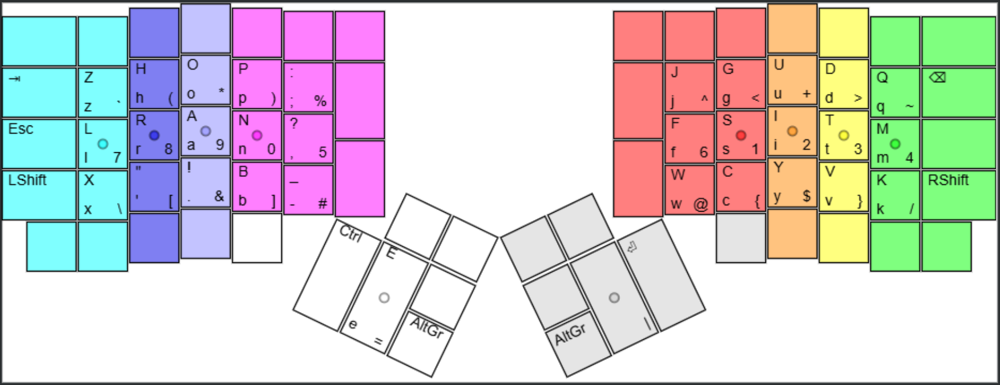

# keygen

An(other) algorithm for generating optimal keyboard layouts.

This code follows the simulated annealing method used in [Carpalx](http://mkweb.bcgsc.ca/carpalx/?simulated_annealing), but with a different model. Here, we try to maximise comfort by minimising the actions that cause discomfort---stretching or compressing the hand in uncomfortable ways.

## STRAIN Layout

This is a fork-of-a-fork of [xsznix/keygen](https://github.com/xsznix/keygen). I used it to design the STRAIN layout.



The file [strain.json](strain.json) is meant to used with this [Keyboard Layout Analyzer](https://stevep99.github.io/keyboard-layout-analyzer).

## Installing and running

You'll need a recent-ish version of [Rust](https://www.rust-lang.org/). The nightly version is used for the `linked_list_cursors` feature.

To run the annealing algorithm, try:
```sh
cargo +nightly run -- run corpus/books.short.txt
```

To refine an existing layout, run:
```sh
cargo +nightly run -- refine corpus/coca.mag.txt strain.txt -s 4
```

If you don't have the nightly toolchain installed, run: `rustup install nightly`.

## Installing the (upcoming) optimal keyboard layout

If you're crazy enough to want to try this, you're probably smart enough to figure out how to install custom keyboards on your system of choice.

## Credits

The simulated annealing algorithm and corpus are taken from Carpalx by Martin Krzywinski.

## Other alternate keyboard layouts

mdickens has a good list of them [here](http://mdickens.me/typing/alternative_layouts.html).

## Licence

MIT
